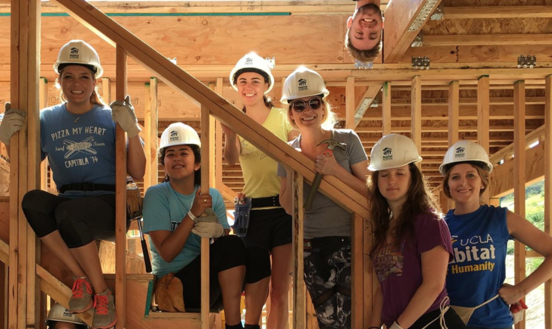

<div style= "float:right;position: relative; top: 0px;">
```{r, out.width = "250px", echo = FALSE, fig.align='right'}

```
</div>

###Columbia Mailman School of Public Health 

Master of Science, Biostatistics

2017 - present
 


<div style= "float:right;position: relative; top: 0px;">
```{r, out.width = "125px", echo = FALSE, fig.align='right'}

```
</div>

###University of California, Los Angeles

Bachelor of Science, Statistics

Minor in Mathematics

2013 - 2017


###ACCENT Study Center, Florence Italy
Study Abroad Program, Italian Language and Art 

Fall 2015


<br>

#Volunteering 
```{r, out.width = "500px", echo = FALSE, fig.align='left'}

```

__Habitat for Humanity__

While at UCLA, I took part in the development of a 72 home community built exclusively for veterans. This housing track in Santa Clarita allows low income veterans to move into homes with built-in equity, and I have had the opportunity to construct these homes alongside the veterans themselves. In my fourth year, I sat on the executive board as Advocacy Chair. Important facets of my leadership position were spreading awareness on UCLA’s campus of the fight against substandard housing, both on local and global scales, and encouraging students to get involved and help us make a difference. Executive board responsibilities include planning fundraisers, coordinating build days on site and organizing free tutoring for children of veterans living in the community.

