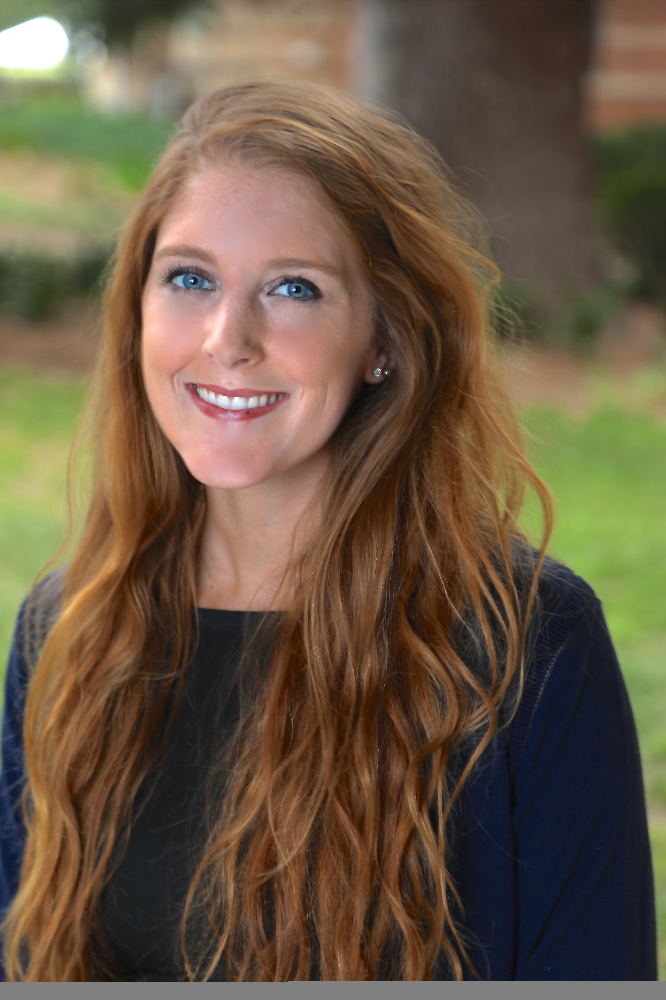

```{r, out.width = "150px", echo = FALSE, fig.align='center'}

```

##Welcome
I am a current Biostatistics student at Columbia University. My research interests include survival analysis, oncology, and Alzheimer's research. 

Feel free to explore my page and contact me if you have any questions! 


 
